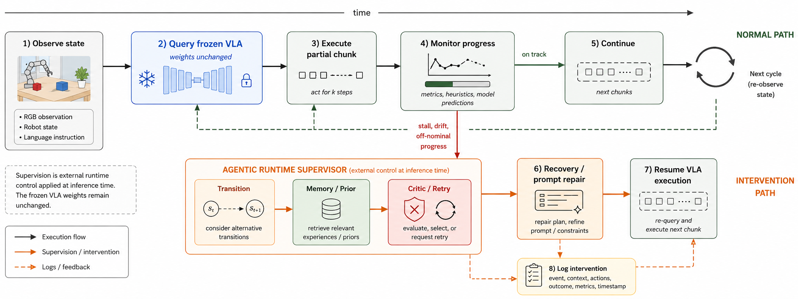

# CARVE-VLA

## 面向长程机器人操作的 Agentic 执行系统与 VLA 高效推理

- 研究方向：Vision-Language-Action 模型高效推理与部署
- 实验平台：OpenPI pi0.5、LIBERO、NVIDIA RTX 4090
- 系统组成：CARVE Agentic Harness + CARVE Optimize Runtime

---

# 1. 研究问题

冻结 VLA 在长程机器人操作中同时面临两个问题：

1. 局部动作能力较强，但仍会出现停滞、抓取失败、子任务衔接失败和恢复失败。
2. Agentic 监测、重试和恢复增加系统计算开销，机器人控制需要满足实时推理约束。

研究问题：

> 如何在不重新训练 VLA 基座模型的条件下，通过 Agentic 执行监督提高
> 长程任务可靠性，并通过部署时优化降低 VLA 关键路径时延？

---

# 2. 系统边界

| 子系统 | 职责 | 不承担的职责 |
|---|---|---|
| CARVE Agentic Harness | 监测、记忆、重试、物理恢复、安全停止 | 不生成基础动作表示 |
| CARVE Optimize Runtime | profile 校准、编译、量化、视图裁剪、时延追踪 | 不使用仿真器特权状态决策 |
| Frozen VLA | 根据图像、状态和语言生成动作块 | 不管理长程恢复流程 |

两个子系统通过 `ActionSpec`、模型能力、推理控制和 runtime trace 连接。

---

# 3. CARVE-VLA 整体框架


- 输入：RGB、wrist RGB、proprioception、language instruction
- 输出：经过动作契约检查的 bounded action chunk
- 所有 intervention、fallback、profile 和 latency 均写入 trace

---

# 4. Agentic Harness 执行流程



正常执行路径：观察 -> VLA 推理 -> 动作提交 -> 进展监测

异常执行路径：风险确认 -> 重规划 -> 物理恢复 -> 验证 -> 重新推理或安全停止

---

# 5. Agentic 功能模块

| 模块 | 输入信号 | 输出行为 |
|---|---|---|
| Transition | 子任务边界、近期位移 | 中间过渡动作或提示 |
| Memory / Prior | 历史失败、恢复结果、任务实体 | 检索紧凑先验 |
| Critic / Retry | stall、任务未完成、状态不一致 | 有限次重规划 |
| Risk Monitor | proprio response、动作幅度、action age、deadline slack | 风险事件 |
| Physical Recovery | 已确认 stall、slip、misgrasp、contact | retract、lift、reobserve |
| Safe Stop | 恢复预算耗尽或验证失败 | 停止动作提交 |

监测器不读取物体真值位姿；仿真器状态只用于实验标签。

---

# 6. Agentic 全量实验背景

冻结 `pi05_libero`，每种方法 200 个回合：

| 方法 | 成功率 | 成功数 |
|---|---:|---:|
| Frozen pi0.5 | `90.0%` | `180/200` |
| Refined Agentic Harness | `92.5%` | `185/200` |

- 主要弱任务由 `55.0%` 提高到 `75.0%`
- Agentic 模块围绕冻结 VLA 工作，不修改基座权重
- 该结果来自早期全量实验；原始 rollout 目录未保留
- 中期主证据采用下页可复现的精确状态配对实验

---

# 7. PI0.5 Recovery Challenge

真实 LIBERO MuJoCo、精确恢复状态、相同 admitted SMVE profile：


| 策略 | 成功 | PI0.5 调用 | 安全停止 |
|---|---:|---:|---:|
| Frozen continuation | `2/3` | `113` | `0` |
| Frequent replan | `2/3` | `452` | `0` |
| Prompt retry | `2/3` | `508` | `0` |
| Physical recovery | `2/3` | `251` | `1` |

- 两个 stall 的物理 skill 均执行 `12` 个有界动作并通过验证
- 不支持的 `stale_action` 不执行 recovery action，按契约安全停止
- 在线 T6 哨兵完成 monitor -> recovery -> verify -> replan -> success
- 三状态实验不作为 benchmark 成功率或统计显著性声明

---

# 8. Agentic 与推理优化的耦合

- Frequent replan 与 prompt retry 未增加成功数，但 PI0.5 调用为继续执行的
  `4.0x/4.5x`
- Agentic controller 决定何时增加计算、何时执行物理 skill、何时停止
- Optimize Runtime 保证每次实际 VLA 调用使用已验收 profile，并记录 deadline
- 系统目标不是“始终多推理”，而是在闭环风险下分配有限推理预算

---

# 9. 联合配对实验

相同 T6/T9 stall 状态、固定噪声、相同物理恢复流程：


| Profile | Success | Recovery | P95 | Miss@80ms |
|---|---:|---:|---:|---:|
| Eager BF16 | `2/2` | `2/2` | `166.26 ms` | `236/236` |
| Compiled BF16 | `2/2` | `2/2` | `65.75 ms` | `0/239` |
| Compiled + SMVE | `2/2` | `2/2` | `54.50 ms` | `0/247` |

- 三种 profile 保持相同精确状态结果
- SMVE 相对 Eager 降低 runtime P95 `67.2%`
- Eager 是未晋升研究参考；两个优化 profile 均通过部署 admission
- 单回合在线结果有波动，不用于 profile 能力排序

---

# 10. Optimize Runtime


部署 profile 绑定：

- checkpoint identity
- GPU 与软件版本
- inference steps
- committed action horizon
- precision / quantization
- backend transformation
- fidelity 与 deadline gate

---

# 11. 分层验收流程

```text
候选 profile
    |
    v
动作空间与 capability 检查
    |
    v
固定噪声 replay fidelity
    |
    v
配对仿真闭环
    |
    v
Agentic 系统端到端验证
```

开放环动作误差、模型时延和显存不能单独决定 profile 是否部署。

---

# 12. Flow-Step 校准

T6/T8/T9 共 15 个固定初始状态：

| Profile | 成功 | 单次 VLA | VLA 时间/回合 | 总时间/回合 |
|---|---:|---:|---:|---:|
| 7 steps, commit 10 | `14/15` | `366.90 ms` | `11.15 s` | `21.27 s` |
| 2 steps, commit 10 | `14/15` | `148.96 ms` | `4.44 s` | `14.40 s` |

- 单次 VLA 推理加速：`2.46x`
- 平均回合总时间降低：`32.3%`
- 两种配置保持相同的配对成功数

---

# 13. RTX 4090 部署 Profile

两步 flow、commit 10、80 ms policy-call deadline：

| Profile | P50 | P95 | Miss | VRAM | 决策 |
|---|---:|---:|---:|---:|---|
| Eager BF16 | `154.34 ms` | `159.59 ms` | `100%` | `7.12 GB` | reference |
| Compiled BF16 | `65.73 ms` | `67.40 ms` | `0%` | `6.98 GB` | accepted |
| Compiled BF16 + SMVE | `54.35 ms` | `56.19 ms` | `0%` | `6.97 GB` | accepted |
| Compiled W8A16 | `69.74 ms` | `71.72 ms` | `0%` | `6.56 GB` | closed-loop rejected |

---

# 14. Static Masked-View Elision

LIBERO pi0.5 输入包含：

- `base_0_rgb`: active
- `left_wrist_0_rgb`: active
- `right_wrist_0_rgb`: zero padding，mask 为 false

原始路径仍对 padding 图像执行 SigLIP。SMVE 在视觉编码前：

1. 根据命名视图契约定位 padding 视图。
2. 运行时断言整批 mask 全为 false。
3. 删除 padding view 后执行 SigLIP 与 prefix KV 构建。
4. 若目标视图处于 active 状态，立即拒绝 profile。

---

# 15. SMVE Fidelity 与闭环结果

Replay gate：

- `45/45` 固定噪声状态通过
- 最差 chunk MAE：`0.00232`
- 最差 cosine：`0.999897`
- gripper agreement：`1.0`

T8/T9 配对闭环：

| Profile | 成功 | VLA P50 | VLA P95 |
|---|---:|---:|---:|
| Compiled BF16 | `7/10` | `65.49 ms` | `69.59 ms` |
| Compiled BF16 + SMVE | `8/10` | `56.80 ms` | `60.60 ms` |

`8/10` 与 `7/10` 仅作为非劣性证据，不表述为成功率提升。

---

# 16. 跨 Checkpoint / Adapter 验证

第二系统配置：官方 `pi05_droid` checkpoint、DROID 输入适配器、commit 5。

| Profile | P50 | P95 | Fidelity | 80 ms miss |
|---|---:|---:|---:|---:|
| Compiled BF16 | `65.09 ms` | `66.22 ms` | `10/10` | `0%` |
| Compiled BF16 + SMVE | `54.66 ms` | `57.34 ms` | `10/10` | `0%` |

- P50/P95 分别降低 `16.0%/13.4%`
- commit 15 因 endpoint L2=`0.18120` 超过门限而被拒绝
- 该实验验证 pi0.5 内的跨 checkpoint/输入适配器可移植性
- 该实验不是 DROID 任务成功率，也不是第二 VLA 模型家族验证

---

# 17. 量化门控

W8A16 对 VLM language layers 0--3 进行组件级量化：

- replay fidelity：`45/45` 通过
- P95：`71.72 ms`
- 峰值显存：`6.56 GB`
- 相比 compiled BF16，显存降低但推理时延增加

在后续配对长程实验中，W8A16 丢失一次 compiled BF16 保留的 T6 恢复成功，
因此当前状态为 closed-loop rejected。

---

# 18. 端到端实时性与异步负结果

| 执行方式 | 成功 | 80 ms miss | 总时间 |
|---|---:|---:|---:|
| Sync, commit 8 | `7/10` | `417/3931` | `205.79 s` |
| Async, every chunk | `5/10` | `48/4287` | `198.21 s` |
| Async, alternating | `5/10` | `176/4278` | `207.58 s` |

- 全异步使 deadline miss rate 相对降低 `89.4%`
- 两种异步配置的成功数均降至 `5/10`
- 当前部署保持同步执行，异步模块保留为实验基础设施

---

# 19. 当前结果边界

已验证：

- Agentic Harness 对冻结 pi0.5 的长程执行监督
- flow-step 与 committed horizon 分离校准
- 编译 BF16 与 SMVE 的 replay/闭环门控
- pi0.5 内跨 LIBERO/DROID adapter 的 SMVE 系统可移植性
- 物理恢复、验证和重新规划闭环
- 精确状态配对实验中的事件触发计算成本与 fail-closed 行为
- 相同 Agentic 恢复流程下 Eager/Compiled/SMVE 的结果保持和 deadline 对比

未声明：

- 新的通用量化算法
- 异步执行已经满足实时机器人部署
- 已在多个 VLA 模型家族或多个 benchmark 上完成验证
- DROID adapter smoke 等价于 DROID 任务成功率
- 三个恢复状态等价于 benchmark-wide 成功率提升
- 单回合在线哨兵等价于 profile 能力排序

---

# 20. 下一阶段

1. 冻结 Agentic Harness 当前功能边界，只进行正确性修复。
2. 扩展 replay corpus，并保持 checkpoint/hardware/profile 可追溯。
3. 扩展预声明的故障恢复状态和随机种子，不重复运行低信息增益的干净榜单。
4. OpenVLA 保留为第二模型接口与低比特负结果，不继续闭环实验。
5. 完成中期材料与论文结果表的一致性审计。
6. 继续以 VLA 高效推理、部署门控和 Agentic 闭环可靠性作为主线。

---

# 证据索引

- 完整中期报告：[`CARVE_VLA_MIDTERM_REPORT_20260717.md`](CARVE_VLA_MIDTERM_REPORT_20260717.md)
- 机器可读结果：[`runtime_results_summary.json`](../../paper/CARVE-VLA/generated/runtime_results_summary.json)
- SMVE gate：[`MASKED_VIEW_ELISION_GATE.md`](../../results/carve_optimize/MASKED_VIEW_ELISION_GATE.md)
- 跨适配器 gate：[`CROSS_ADAPTER_SMVE_GATE.md`](../../results/carve_optimize/CROSS_ADAPTER_SMVE_GATE.md)
- 实时性负结果：[`PREFETCH_5STATE_GATE.md`](../../results/carve_realtime/PREFETCH_5STATE_GATE.md)
- 实验日志：[`EXPERIMENT_LOG.md`](../status/EXPERIMENT_LOG.md)
- Recovery Challenge：[`REPORT.md`](../../results/carve_pi05_recovery_challenge_20260719/REPORT.md)
- 在线恢复视频：[`task6 recovery video`](../../results/carve_pi05_recovery_challenge_20260719/online_controller/videos/task6_trial0_success_put_the_white_mug_on_the_plate_and_put_the_chocolate_pudding_to_the_right_of_the_plate.mp4)
- Agentic-Optimize 联合实验：[`REPORT.md`](../../results/carve_pi05_agentic_optimize_pair_20260719/REPORT.md)
