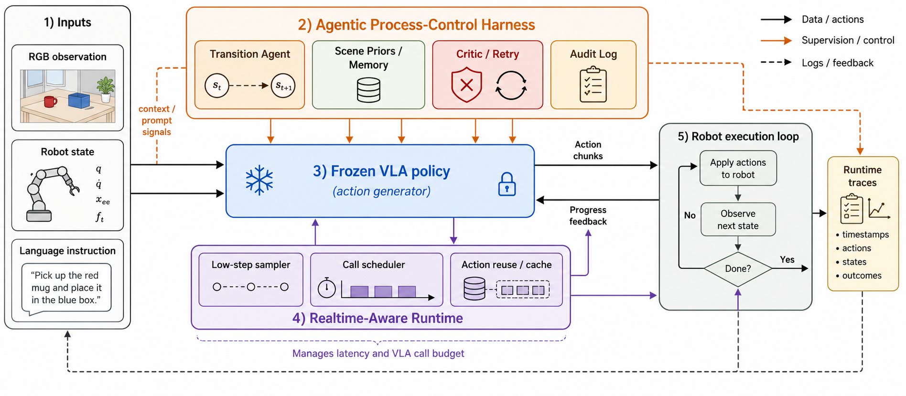
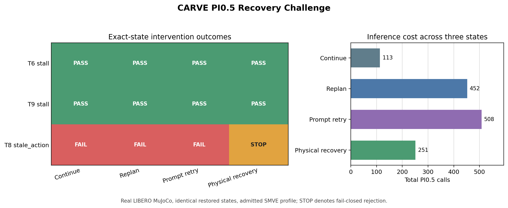
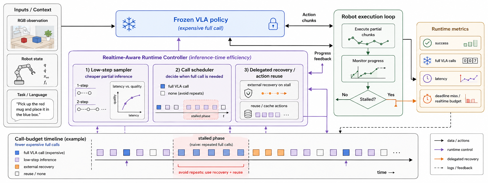
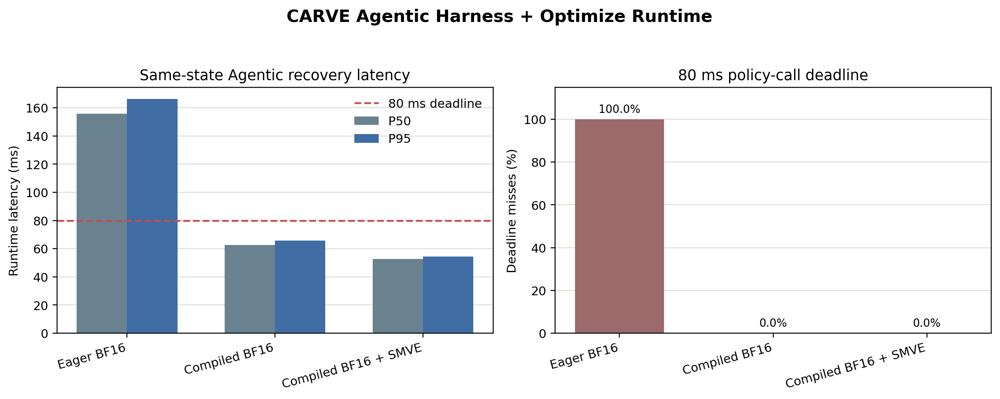

# CARVE-VLA 中期成果汇报

更新时间：2026-07-19

## 1. 课题方向与研究问题

开题方向为 **VLA 高效推理与部署优化**。当前工作研究以下问题：

> 在不重新训练 VLA 基座模型的条件下，如何同时降低推理时延与部署
> 成本，并通过 Agentic 执行系统保证长程机器人任务中的闭环可靠性？

CARVE-VLA 将系统划分为两个边界明确的部分：

1. **CARVE Agentic Harness**：负责长程执行监督、风险检测、恢复、记忆和安全停止。
2. **CARVE Optimize Runtime**：负责 VLA 推理步数、动作提交长度、编译后端、精度配置和实时调度。

VLA 高效推理是主要研究方向；Agentic Harness 提供具身闭环环境，用于验证优化后的模型是否仍能完成任务和恢复失败。



## 2. 整体框架

系统执行链为：

```text
RGB / wrist RGB / proprioception / instruction
                    |
                    v
       deployable execution monitor
                    |
          risk + deadline + memory
                    |
                    v
       Agentic recovery controller
     reuse / VLA / retry / recovery / stop
                    |
                    v
          CARVE Optimize Runtime
 profile validation / compile / flow steps / trace
                    |
                    v
              frozen VLA
                    |
                    v
       bounded action chunk -> simulator
```

两个子系统通过 `ActionSpec`、模型能力、推理控制和 runtime trace 交互。优化后端不能静默改变动作空间或推理配置；所有请求、实际应用配置、回退和时延均写入 trace。

## 3. Agentic Harness

### 3.1 执行监测

监测器仅使用可部署信号：RGB、末端执行器与夹爪状态、历史动作、动作年龄和实测 deadline slack。仿真器物体真值仅用于评测标签，不进入控制器。

### 3.2 长程任务模块

| 模块 | 功能 | 当前状态 |
|---|---|---|
| Transition | 处理子任务边界与状态缺口 | 已完成并参与 LIBERO-10 对比 |
| Memory / Prior | 检索任务先验和历史恢复结果 | 已完成 |
| Critic / Retry | 检测失败并触发有限次重规划 | 已完成；部分配置触发率偏低 |
| Risk Monitor | 检测 stall、slip、misgrasp、contact 和动作陈旧 | 已完成 |
| Physical Recovery | retract、lift、reobserve、verify、replan | 已完成并通过在线闭环验证 |
| Safe Stop | 恢复预算耗尽或验证失败后停止 | 已完成 |

### 3.3 历史全量结果（背景证据）

LIBERO-10 使用冻结的 `pi05_libero`，每种方法共 200 回合：

| 方法 | 成功率 | 成功数 |
|---|---:|---:|
| Frozen pi0.5 baseline | `90.0%` | `180/200` |
| Refined CARVE Agentic Harness | `92.5%` | `185/200` |

主要弱任务由 `55.0%` 提高到 `75.0%`。该结果来自早期全量实验，原始
rollout 目录在项目清理时未保留，因此仅作为研究背景，不作为当前可复现
主证据，也不据此归因单个 Agentic 模块。

### 3.4 PI0.5 Recovery Challenge（当前主证据）

为避免在接近饱和的干净任务上重复刷分，当前实验使用真实 LIBERO MuJoCo
环境和精确恢复的机器人状态，固定 admitted `compiled BF16 + SMVE` profile，
比较四种执行策略：冻结 VLA 继续执行、频繁 VLA 重规划、prompt retry、物理
恢复后重规划。三个状态覆盖两个可恢复 stall 和一个不受当前物理 skill 支持的
`stale_action`。



| 状态 | Continue | Replan | Prompt retry | Physical recovery |
|---|---:|---:|---:|---:|
| T6 stall | 成功 | 成功 | 成功 | 成功 |
| T9 stall | 成功 | 成功 | 成功 | 成功 |
| T8 stale action | 失败 | 失败 | 失败 | 安全停止 |

四种策略成功数均为 `2/3`，但 PI0.5 调用数分别为 `113/452/508/251`。
因此该小规模因果实验不支持“Agentic 提升平均成功率”的声明；它支持两个更
明确的系统结论：频繁重规划或 prompt retry 在瞬时 stall 上没有带来额外成功，
却使用约 `4.0x/4.5x` 的 VLA 调用；当前物理 skill 在两个受支持 stall 上均
完成 12 个有界动作并通过状态响应验证，而面对不支持的 `stale_action` 时按
契约 fail closed，没有执行未经验证的动作。

独立的在线 T6 哨兵实验进一步验证了自动闭环：monitor 检测重复 stall，
controller 选择物理恢复，executor 完成 `12` 个动作并验证，随后重新调用
PI0.5，任务最终成功。该实验为 `1/1` 生命周期验证，不被表述为成功率统计。

## 4. VLA 高效推理与部署优化



### 4.1 分层优化流程

1. 在配对闭环轨迹上校准 flow steps 和 committed actions。
2. 对模型、checkpoint、GPU 和 backend 生成固定 deployment profile。
3. 使用记录观测进行动作保真度检查。
4. 仅将通过 replay gate 的配置送入闭环机器人评测。
5. 根据成功率、时延、显存和 deadline miss 选择部署配置。

### 4.2 Flow-step 校准

T6/T8/T9 共 15 个固定状态：

| 配置 | 成功 | 单次 VLA 时延 | 每回合模型时间 | 每回合总时间 |
|---|---:|---:|---:|---:|
| 7 flow steps, commit 10 | `14/15` | `366.90 ms` | `11.15 s` | `21.27 s` |
| 2 flow steps, commit 10 | `14/15` | `148.96 ms` | `4.44 s` | `14.40 s` |

两步配置保持配对成功数，VLA 单次调用加速 `2.46x`，回合总时间降低 `32.3%`。

### 4.3 RTX 4090 部署配置

| 配置 | P50 | P95 | 80 ms miss | 峰值显存 | 闭环决策 |
|---|---:|---:|---:|---:|---|
| Eager BF16 | `154.34 ms` | `159.59 ms` | `100%` | `7.12 GB` | 参考配置 |
| Compiled BF16 | `65.73 ms` | `67.40 ms` | `0%` | `6.98 GB` | 当前默认 |
| Compiled BF16 + SMVE | `54.35 ms` | `56.19 ms` | `0%` | `6.97 GB` | padding-view 场景默认 |
| Compiled W8A16 | `69.74 ms` | `71.72 ms` | `0%` | `6.56 GB` | 闭环否决 |

W8A16 在 45 个 replay 观测上通过动作保真度检查，但在配对长程实验中丢失一次 BF16 可恢复的成功，因此没有被描述为有效轻量化结果。该结果说明开放环动作误差和模型时延不足以替代具身闭环验证。

### 4.4 Static Masked-View Elision

LIBERO 输入只有 base 与 left-wrist 两路有效图像；OpenPI 为缺失的
right-wrist 相机补零并设置 `image_mask=False`，但原始 PyTorch pi0.5 仍会
先执行第三路 SigLIP 编码。SMVE 在运行时断言目标 mask 全假，然后在
视觉编码和 prefix KV 构建前删除该 padding 视角。该操作不跨时刻缓存
观测，也不删除任何有效视觉 token。

45 个固定噪声 replay 状态全部通过动作保真度门控：最差 chunk MAE 为
`0.00232`、余弦为 `0.999897`、夹爪一致率为 `1.0`。相对 compiled BF16，
模型 P50/P95 降低 `18.9%/16.9%`，runtime P50/P95 降低 `17.3%/16.6%`。

T8/T9 各 5 个固定状态的同步闭环结果如下：

| 配置 | 成功 | T8 | T9 | VLA P50 | VLA P95 |
|---|---:|---:|---:|---:|---:|
| Compiled BF16 | `7/10` | `4/5` | `3/5` | `65.49 ms` | `69.59 ms` |
| Compiled BF16 + SMVE | `8/10` | `5/5` | `3/5` | `56.80 ms` | `60.60 ms` |

该结果用于支持闭环非劣性，不将 `8/10` 与 `7/10` 的差异表述为成功率提升。

为检查实现是否绑定于 LIBERO checkpoint，进一步将官方 `pi05_droid`
checkpoint 转换为 PyTorch，并通过 DROID 输入适配器执行固定输入的系统门控：

| DROID profile | Runtime P50 | Runtime P95 | Fidelity | 80 ms miss |
|---|---:|---:|---:|---:|
| Compiled BF16, commit 5 | `65.09 ms` | `66.22 ms` | `10/10` | `0%` |
| Compiled BF16 + SMVE, commit 5 | `54.66 ms` | `57.34 ms` | `10/10` | `0%` |

该实验验证了同一 pi0.5 插件跨 checkpoint 与输入适配器的可移植性，不是
DROID 任务成功率实验，也不代表已经支持第二个 VLA 模型家族。commit 15
配置因 endpoint L2 超过门限被拒绝，门限未做放宽。

### 4.5 端到端实时性

Compiled BF16 的模型调用满足 80 ms，但同步控制还包含图像处理与 MuJoCo step，VLA 控制步 P95 为 `114.01 ms`。异步预取降低 deadline miss，但在扩大实验中损失任务成功：

| 执行方式 | 成功 | 80 ms miss | 总时间 |
|---|---:|---:|---:|
| 同步 commit 8 | `7/10` | `417/3931` | `205.79 s` |
| 全异步预取 | `5/10` | `48/4287` | `198.21 s` |
| 交替异步 | `5/10` | `176/4278` | `207.58 s` |

异步配置虽然将 miss rate 相对降低 `89.4%`，但未通过闭环成功率门控。
当前保持同步执行，并在具有静态 padding 视角的输入上采用 compiled BF16 + SMVE。

### 4.6 Agentic Harness 与 Optimize Runtime 联合实验

为直接验证推理优化是否在 Agentic 恢复过程中仍然成立，使用 T6/T9 两个
精确恢复的 stall 状态、固定噪声、相同 2-step/commit-10 配置和相同物理
恢复流程，对比 Eager BF16、Compiled BF16 和 Compiled BF16 + SMVE。
Eager 仅作为显式未晋升研究参考；两个优化 profile 均使用正式 deployment
admission manifest。



| Profile | Exact success | Recovery verified | Runtime P50 | Runtime P95 | 80 ms miss |
|---|---:|---:|---:|---:|---:|
| Eager BF16 | `2/2` | `2/2` | `155.88 ms` | `166.26 ms` | `236/236` |
| Compiled BF16 | `2/2` | `2/2` | `62.54 ms` | `65.75 ms` | `0/239` |
| Compiled BF16 + SMVE | `2/2` | `2/2` | `52.54 ms` | `54.50 ms` | `0/247` |

三种 profile 保持完全相同的精确状态任务结果和恢复验证结果。Compiled BF16
和 SMVE 的 runtime P95 相对 Eager 分别降低 `60.5%` 和 `67.2%`；SMVE 相对
普通 Compiled BF16 进一步降低 `17.1%`。该结果直接连接了 Agentic 与推理
优化：恢复流程不变时，正式 admitted profile 将 policy-call 延迟压到 80 ms
以内。

每种 profile 另运行一次从初始状态开始的在线 T6 哨兵，结果为 `1/1、0/1、
1/1`。该单回合结果显示长程在线轨迹对动作数值差异敏感，因此不作为 profile
能力排序；论文级行为保持结论以精确状态配对实验为准。

## 5. 时序重锚定诊断

为分析异步失败，新增 action-prefix consistency verifier，对比旧观测预测的两步前缀与实际执行的两步缓存动作。shadow 模式完成 10 回合、279 次检查：

| 指标 | 成功回合 | 失败回合 |
|---|---:|---:|
| 前缀拒绝率 | `7.21%` | `7.66%` |

拒绝率与失败的相关系数为 `0.058`，AUC 为 `0.563`。该指标不能可靠区分成功和失败，因此没有运行 enforce 或阈值搜索。此实验被记录为诊断性负结果。

## 6. 当前结论

### 已验证的正结果

- 历史 LIBERO-10 汇总从 `180/200` 提高到 `185/200`，但因原始 rollout
  目录未保留，只作为背景结果。
- 当前可复现 Recovery Challenge 完成 `3` 个精确状态、`4` 个配对分支；
  两个受支持 stall 的物理恢复均通过验证，在线 T6 恢复生命周期 `1/1` 完成。
- 频繁重规划和 prompt retry 未增加三个状态的成功数，却分别使用冻结继续
  执行 `4.0x` 和 `4.5x` 的 PI0.5 调用，支持事件触发的分级干预设计。
- Agentic-Optimize 联合实验保持三种 profile 的 `2/2` 精确状态恢复结果；
  SMVE 将 runtime P95 从 Eager 的 `166.26 ms` 降至 `54.50 ms`，并将
  80 ms miss 从 `236/236` 降至 `0/247`。
- 两步 flow 校准保持 `14/15` 配对成功并实现 `2.46x` VLA 调用加速。
- compiled BF16 在 RTX 4090 上达到 `67.40 ms` P95 和 `0%` 80 ms miss。
- SMVE 在保持 45/45 replay fidelity 和 T8/T9 闭环非劣的条件下，将
  runtime P95 进一步降至 `56.19 ms`。
- DROID checkpoint/adapter 的 10-state 系统门控中，SMVE 相对普通编译将
  runtime P95 从 `66.22 ms` 降至 `57.34 ms`，两者均通过 fidelity。
- 物理恢复完成监测、动作执行、结果验证和重新规划闭环。

### 已否决的候选

- W8A16：开放环保真度通过，但闭环恢复结果退化。
- 全异步与交替异步：deadline miss 改善，但任务成功率下降。
- 前缀一致性 enforce：shadow 指标无预测性，因此未执行。

### 当前不作出的声明

- 不声称提出了新的量化算法。
- 不声称异步执行已经解决机器人实时控制问题。
- 不声称框架已经在多个 VLA 模型家族或多个 benchmark 上验证。
- 不使用仿真器物体真值作为部署控制输入。
- 不把三个恢复状态解释为 benchmark 成功率，也不声称当前挑战证明了
  Agentic 的统计显著成功率提升。
- 不用单回合在线哨兵的 `1/1、0/1、1/1` 对 profile 进行能力排序。

## 7. 下一阶段计划

1. 冻结当前 Agentic Harness 功能边界，只修复正确性问题。
2. 以 PI0.5 为唯一闭环主模型，固定 admitted SMVE/fallback deployment profile。
3. 将 Recovery Challenge 扩展到预声明的更多故障状态和随机种子，而不是
   重跑接近饱和的干净 LIBERO-10。
4. 保留 OpenVLA 为接口与量化负结果，不继续消耗闭环实验资源。
5. 将 SMVE、编译、flow-step 校准、deployment admission 与 Agentic recovery
   组织为中期汇报和下一版论文主线。

OpenVLA 的模块级分析表明自回归 decode 占 BF16 CUDA 路径的 `67.2%`。
预热后的 LLM 编译 profile 将 P50/P95 从 `303.48/310.92 ms` 降至
`224.25/231.84 ms`，并保持 `10/10` 动作完全一致；但两种 prompt 长度需
`200.19 s` profile preparation，且仍未达到 100 ms deadline。因此该结果
用于证明跨模型优化接口和 decode 加速，不表述为 10 Hz 实时部署完成。

## 8. 建议汇报结构

1. 研究背景与开题问题。
2. 当前 VLA 部署中的长程可靠性与实时性矛盾。
3. CARVE-VLA 总体框架。
4. Agentic Harness 模块与执行流程。
5. Recovery Challenge 与在线物理恢复视频。
6. Optimize Runtime 与分层 acceptance gate。
7. Flow-step 校准结果。
8. RTX 4090 编译与量化结果。
9. 端到端实时性实验及异步负结果。
10. 当前贡献边界、下一阶段计划。

## 9. 证据索引

- 当前完成度总览：[CARVE_VLA_COMPLETED_WORK.md](../status/CARVE_VLA_COMPLETED_WORK.md)
- 中期演示稿：[CARVE_VLA_MIDTERM_PRESENTATION_20260717.md](CARVE_VLA_MIDTERM_PRESENTATION_20260717.md)
- 口头问答准备：[CARVE_VLA_MIDTERM_QA_20260717.md](CARVE_VLA_MIDTERM_QA_20260717.md)
- 论文：[root.pdf](../../paper/CARVE-VLA/root.pdf)
- 统一结果：[runtime_results_summary.json](../../paper/CARVE-VLA/generated/runtime_results_summary.json)
- 实验日志：[EXPERIMENT_LOG.md](../status/EXPERIMENT_LOG.md)
- Runtime 架构：[CARVE_RUNTIME_ARCHITECTURE.md](../architecture/CARVE_RUNTIME_ARCHITECTURE.md)
- Optimize Runtime：[CARVE_OPTIMIZE_RUNTIME.md](../architecture/CARVE_OPTIMIZE_RUNTIME.md)
- 前缀诊断：[prefix_diagnostic.json](../../results/carve_realtime/prefix_shadow_t89_5states_20260717/prefix_diagnostic.json)
- SMVE gate：[MASKED_VIEW_ELISION_GATE.md](../../results/carve_optimize/MASKED_VIEW_ELISION_GATE.md)
- 跨适配器 gate：[CROSS_ADAPTER_SMVE_GATE.md](../../results/carve_optimize/CROSS_ADAPTER_SMVE_GATE.md)
- Recovery Challenge：[REPORT.md](../../results/carve_pi05_recovery_challenge_20260719/REPORT.md)
- Recovery Challenge 图：[recovery_challenge.png](../../results/carve_pi05_recovery_challenge_20260719/recovery_challenge.png)
- 在线恢复视频：[task6 recovery video](../../results/carve_pi05_recovery_challenge_20260719/online_controller/videos/task6_trial0_success_put_the_white_mug_on_the_plate_and_put_the_chocolate_pudding_to_the_right_of_the_plate.mp4)
- Agentic-Optimize 联合实验：[REPORT.md](../../results/carve_pi05_agentic_optimize_pair_20260719/REPORT.md)
- Agentic-Optimize 图：[agentic_optimize_pair.png](../../results/carve_pi05_agentic_optimize_pair_20260719/agentic_optimize_pair.png)
